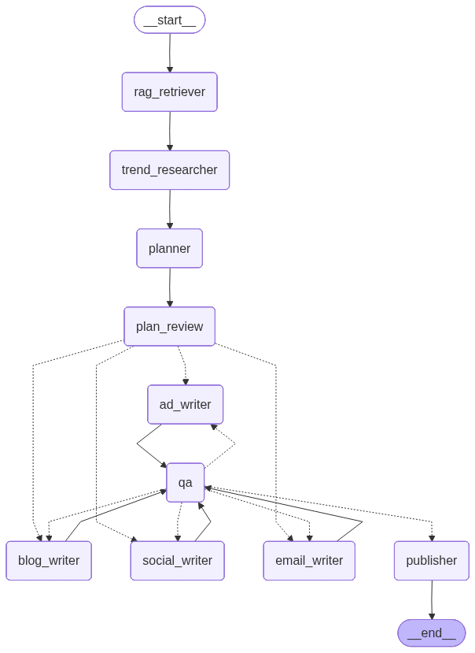

# AI Content Marketing Engine

A **production-grade multi-agent AI system** that turns a single brand brief into a full month of marketing content. Built on LangGraph with a parallel writer fan-out, a QA → revision loop, RAG-backed brand voice, web-search trend research, and one-click publishing to Notion and Buffer.

## Demo

[Watch the demo on Loom](https://www.loom.com/share/78e54629481a4c1e88f53b4dde1c4955)

## What it does

1. Takes a user's brand brief as input
2. Researches trending topics via web search (Serper)
3. Retrieves brand voice context from uploaded documents (RAG via Qdrant)
4. Builds a 4-week content calendar
5. *(Optional)* Pauses for **human approval** of the calendar — edit or approve it before any drafts are written
6. Generates blog posts, social copy, email newsletters, and ad copy **in parallel**
7. Runs a QA agent that scores each piece and sends failed pieces back for revision (max 2 rounds)
8. Publishes approved content to Notion and Buffer (falls back to local `./output/` files)
9. Streams live progress to the Streamlit UI as each agent completes
10. Publishes blog posts to **Storyblok** as draft stories via a dedicated FastAPI publishing service

## Tech stack

- **LangGraph** — multi-agent state machine (parallel `Send()` fan-out, conditional QA routing, cyclic re-write loop)
- **OpenAI GPT-4o** (primary) + **Anthropic Claude `claude-sonnet-4-6`** (automatic fallback) — all agents use the same factory in `backend/llm.py`; if OpenAI hits a rate limit or outage, every call transparently retries against Claude
- **Qdrant** — vector database for RAG
- **Streamlit** — UI
- **Serper API** — web search
- **Notion API + Buffer API** — publishing
- **Storyblok Management API** — blog publishing (via isolated FastAPI service)
- **FastAPI + uvicorn** — internal publishing microservice (owns the Storyblok token, never exposed to Streamlit)
- **Docker Compose** — local + deployment
- **Railway / Streamlit Cloud** — cloud deployment

## Architecture

```
START
  → rag_retriever          (populates brand_context from Qdrant)
  → trend_researcher       (web search → keywords + gaps)
  → planner                (builds content calendar JSON)
  → plan_review            (HITL gate: pauses for human approval iff require_approval)
  → [Send() fan-out]       (parallel: blog_writer, social_writer, email_writer, ad_writer)
  → qa                     (scores all pieces, routes approved vs rejected)
  → [conditional]          (if rejected & revision_round < 2 → fan back to writers)
  → publisher              (pushes to Notion + Buffer)
END
```



**Human-in-the-loop (optional).** Tick *"Review plan before writing"* in the sidebar
to pause the run at `plan_review`: the proposed calendar is surfaced in an editable
table and **no drafts are generated until you approve** (edits flow straight into the
writers). This path runs on a checkpointed graph
(`build_graph(checkpointer=MemorySaver())`); the default non-interactive run is
unaffected and needs no checkpointer. Implemented with LangGraph's `interrupt()` /
`Command(resume=...)` — see `backend/agents/plan_review.py`.

All agents read from and write to a single shared `ContentState` TypedDict (see `backend/graph/state.py`).

## Project structure

```
content-marketing-engine/
├── backend/
│   ├── agents/          # trend_researcher, planner, writers, qa_agent, publisher
│   ├── rag/             # ingest, retriever
│   ├── graph/           # state, builder
│   ├── api/             # FastAPI publishing service
│   │   ├── main.py      #   endpoints: GET /health, POST /publish/storyblok
│   │   └── models.py    #   Pydantic request/response models
│   └── publishing/
│       ├── publisher_client.py   # Streamlit → FastAPI HTTP client (no Storyblok token)
│       └── storyblok/            # Storyblok logic: config, client, schema, mapper, service
├── app.py             # Streamlit entry point
├── brand_docs/        # Drop brand PDFs/TXTs/MDs here
├── tests/             # test_graph.py, test_storyblok_publishing.py
├── docker-compose.yml
├── Dockerfile
├── requirements.txt
├── .env.example
└── README.md
```

## Setup (run in order)

```bash
# 1. Create and activate virtual environment
python -m venv venv
source venv/bin/activate  # Windows: venv\Scripts\activate

# 2. Install dependencies
pip install -r requirements.txt

# 3. Copy and fill environment variables
cp .env.example .env
# Edit .env with your API keys

# 4. Start Qdrant locally
docker run -d -p 6333:6333 qdrant/qdrant

# 5. Add brand documents to brand_docs/ folder
# (PDF, TXT, or MD files — style guide, past content, tone guide)

# 6. Ingest brand documents into Qdrant
python -m backend.rag.ingest --docs ./brand_docs/

# 7. Run tests
pytest tests/ -v

# 8. Start the Streamlit app
streamlit run app.py
# Opens at http://localhost:8501

# 9. (Optional) Start the Storyblok publishing service — needed for "Publish to Storyblok"
uvicorn backend.api.main:app --host 0.0.0.0 --port 8000
# Health check: http://localhost:8000/health

# 10. For Docker (alternative to steps 4-9 — starts Qdrant + app + publishing API together)
docker compose up --build
```

## Environment variables

| Key | Required | Notes |
|---|---|---|
| `OPENAI_API_KEY` | ✅ primary LLM | All agents use this first |
| `OPENAI_MODEL` | optional | Model name, defaults to `gpt-4o` |
| `ANTHROPIC_API_KEY` | ✅ fallback LLM | Auto-used if OpenAI fails; set both for full protection |
| `ANTHROPIC_MODEL` | optional | Model name, defaults to `claude-sonnet-4-6` |
| `VOYAGE_API_KEY` | ✅ | RAG embeddings (`voyage-3`, 1024 dims) — key at voyageai.com |
| `SERPER_API_KEY` | ✅ | Web search — free key at serper.dev (2500/month) |
| `QDRANT_URL` | ✅ | `http://localhost:6333` locally; cluster URL for cloud |
| `QDRANT_API_KEY` | for cloud | Only needed for Qdrant Cloud |
| `NOTION_TOKEN`, `NOTION_DATABASE_ID` | optional | Publishing — app works without these |
| `BUFFER_TOKEN`, `BUFFER_PROFILE_IDS` | optional | Publishing — app works without these |
| `STORYBLOK_MANAGEMENT_TOKEN` | optional | Storyblok write token — **FastAPI service only**, never set in the Streamlit process |
| `STORYBLOK_SPACE_ID` | optional | Target Storyblok space ID (FastAPI service) |
| `STORYBLOK_REGION` | optional | Storyblok MAPI host: `eu` (default), `us`, `ap`, `ca`, `cn` |
| `STORYBLOK_BLOG_PARENT_ID` | optional | Folder story ID to nest blog stories under |
| `PUBLISHER_API_KEY` | optional | Shared secret between Streamlit and the FastAPI publisher (both processes must have it) |
| `PUBLISHER_API_URL` | optional | FastAPI base URL seen by Streamlit — `http://localhost:8000` locally, `http://api:8000` in Docker Compose |
| `LANGSMITH_API_KEY`, `LANGSMITH_TRACING`, `LANGCHAIN_PROJECT` | optional | LangSmith observability |

If only one LLM key is set, the app uses whichever is available (no fallback). If publishing keys are absent, the publisher saves all content to `./output/` as Markdown.

## Storyblok publishing service (FastAPI)

Blog posts can be published directly to Storyblok as draft stories via the "Publish to Storyblok" button in the Blog tab. This feature runs as a **separate FastAPI microservice** — isolated from the LangGraph pipeline — for a security reason: the Storyblok Management token must never be loaded into the Streamlit process.

```
Streamlit UI
  └─► publisher_client.py  (sends content + X-API-Key header; no Storyblok token)
        └─► POST /publish/storyblok  (FastAPI on port 8000)
              └─► Storyblok Management API  (token lives here only)
```

### How it works

1. The FastAPI service discovers the Storyblok space's component schema at startup (no hardcoding).
2. Each approved blog post is mapped to a `page` story containing `text` bloks (markdown → Storyblok rich-text format).
3. Stories are created as **drafts** by default (`publish: false`); set `publish: true` in the request to go live immediately.
4. Slugs are deterministic — re-running creates/updates the same story (idempotent).

### Running the service locally

```bash
# In a second terminal (alongside streamlit run app.py)
uvicorn backend.api.main:app --host 0.0.0.0 --port 8000
```

Set these env vars before starting (in `.env` or your shell):

```
STORYBLOK_MANAGEMENT_TOKEN=sb_pat_...   # write-scoped token from Storyblok UI
STORYBLOK_SPACE_ID=123456
PUBLISHER_API_KEY=any-random-secret     # same value in both .env files / processes
PUBLISHER_API_URL=http://localhost:8000 # Streamlit process only
```

### API endpoints

| Method | Path | Auth | Description |
|---|---|---|---|
| `GET` | `/health` | none | Liveness check; returns `storyblok_configured` flag |
| `POST` | `/publish/storyblok` | `X-API-Key` header | Publish blog pieces as Storyblok draft stories |

**`POST /publish/storyblok` request body:**

```json
{
  "pieces": [
    { "topic": "AI in Marketing", "draft": "# Week 1\n...", "week": 1 }
  ],
  "publish": false
}
```

**Response:**

```json
{
  "results": [
    {
      "topic": "AI in Marketing",
      "status": "created",
      "story_id": 987654,
      "url": "https://app.storyblok.com/...",
      "full_slug": "ai-in-marketing-week-1"
    }
  ]
}
```

Possible `status` values: `created`, `updated`, `error`.

## Deployment

### Option A — Streamlit Community Cloud (free)
1. Push to a public GitHub repo
2. https://share.streamlit.io → New app → main file `app.py`
3. Add all env vars under Advanced settings → Secrets
4. Use **Qdrant Cloud** (https://cloud.qdrant.io, free 1GB) since Streamlit Cloud can't host local Qdrant — set `QDRANT_URL` and `QDRANT_API_KEY` in secrets

### Option B — Railway (Docker, full stack)
1. Push to GitHub → https://railway.app → Deploy from GitHub repo (auto-detects Dockerfile)
2. Add env vars in Settings → Variables
3. Add a second Railway service using the `qdrant/qdrant` image; point `QDRANT_URL` at its internal URL

### Option C — Local + ngrok (quickest demo)
```bash
docker run -p 6333:6333 qdrant/qdrant             # Terminal 1
python -m backend.rag.ingest --docs ./brand_docs/  # Terminal 2
streamlit run app.py                               # Terminal 3
ngrok http 8501                                    # Terminal 4
```

### Option D — Full Docker Compose
```bash
docker compose up --build
docker compose exec app python -m backend.rag.ingest --docs ./brand_docs/
# Streamlit app:      http://localhost:8501
# FastAPI publisher:  http://localhost:8000
# Qdrant:             http://localhost:6333
```

> In Docker Compose, set `PUBLISHER_API_URL=http://api:8000` (the internal service name) so Streamlit can reach the FastAPI container.

## Testing

```bash
pytest tests/ -v
```

The test suite covers the QA routing logic, the writer fan-out, and the blog writer node (with the LLM mocked).
